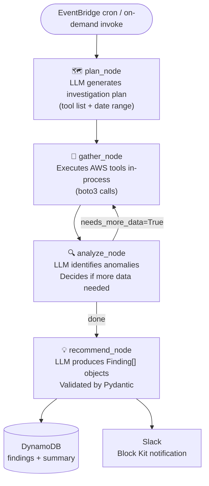
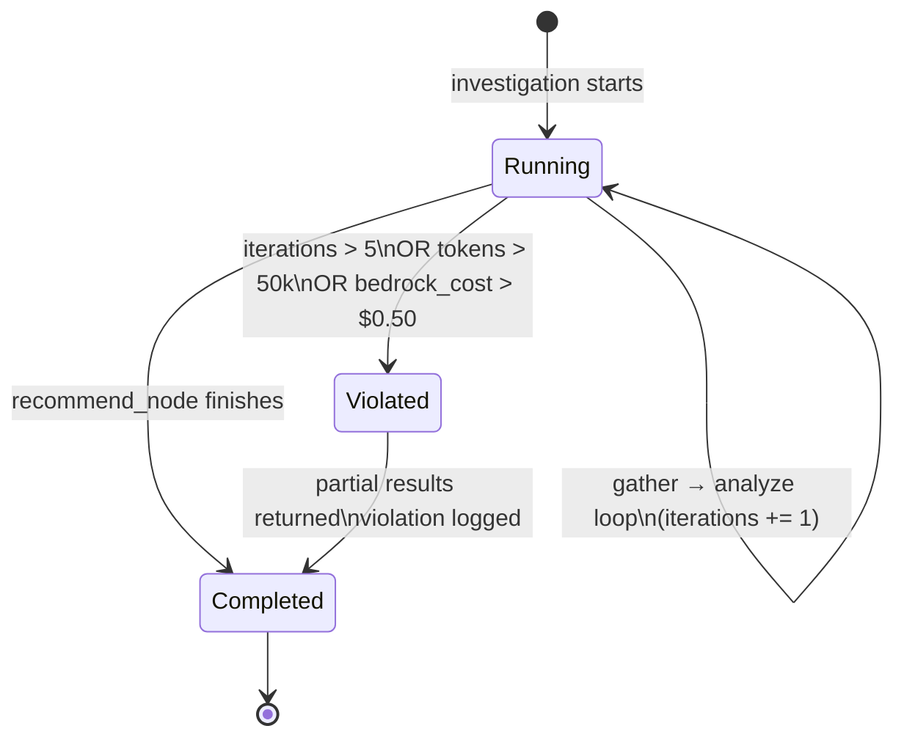
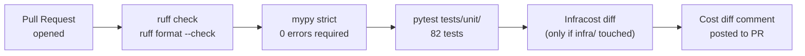

# Architecture — FinOps Agent

Extended architecture reference for AWS Community Day 2026.

---

## Agent Graph



**Guardrails enforced at every edge:**
- Max 5 iterations (plan→gather→analyze loop)
- Max 50,000 tokens per investigation
- Max $0.50 Bedrock cost per run

---

## Infrastructure

```mermaid
flowchart TB
    subgraph triggers["Triggers"]
        eb_cron["EventBridge\nweekly cron\n(Monday 09:00 UTC)"]
        eb_od["EventBridge\non-demand rule\n(InvestigationRequest)"]
        cli["AWS CLI\nlambda invoke"]
    end

    subgraph lambda["Lambda — finops-agent-agent-dev"]
        handler["handler.py\nlambda_handler()"]
        graph["LangGraph\nStateGraph"]
        tools["TOOL_REGISTRY\n12 AWS tools (boto3)"]
        guardrails["Guardrails\niter / token / cost limits"]
    end

    subgraph bedrock["Amazon Bedrock"]
        claude["Claude Sonnet 4.5\nanthropics.claude-sonnet-4-5"]
    end

    subgraph storage["Storage"]
        dynamo_tbl[("DynamoDB\nfinops-agent-findings-dev\nTTL: 90 days")]
        s3_bucket[("S3\nfinops-agent-reports-dev\nMarkdown reports")]
    end

    subgraph notifications["Notifications"]
        sns["SNS Topic\nfinops-agent-alerts-dev"]
        slack_wh["Slack Webhook\nBlock Kit messages"]
    end

    subgraph ci["CI/CD"]
        github["GitHub Actions\nci.yml"]
        infracost["Infracost\ncost diff on PR"]
    end

    eb_cron --> handler
    eb_od --> handler
    cli --> handler

    handler --> graph
    graph --> tools
    graph --> guardrails
    graph <--> claude

    graph --> dynamo_tbl
    graph --> sns
    sns --> slack_wh
    graph --> s3_bucket

    github --> infracost
```

---

## Tool Registry

The 12 in-process tools available to the agent during `gather_node`:

| Module | Tool | AWS API | Purpose |
|---|---|---|---|
| `cost_explorer.py` | `get_cost_and_usage` | Cost Explorer | Monthly spend by service |
| `cost_explorer.py` | `get_cost_anomaly_detection` | Cost Explorer | Anomaly detection results |
| `cloudwatch.py` | `get_metric_statistics` | CloudWatch | NAT GW / Lambda metrics |
| `cloudwatch.py` | `get_log_groups_without_retention` | CloudWatch Logs | Log groups missing retention |
| `ec2_inventory.py` | `list_unattached_ebs_volumes` | EC2 | Volumes in state=available |
| `ec2_inventory.py` | `list_unassociated_eips` | EC2 | EIPs with no InstanceId |
| `ec2_inventory.py` | `list_stopped_instances` | EC2 | Instances stopped >30 days |
| `ec2_inventory.py` | `list_gp2_volumes` | EC2 | Volumes with type=gp2 |
| `ec2_inventory.py` | `list_old_snapshots` | EC2 | Snapshots >90 days |
| `ec2_inventory.py` | `list_nat_gateways` | EC2 | NAT GW inventory |
| `ec2_inventory.py` | `list_oversized_lambdas` | CloudWatch Insights | Lambda memory utilization |
| `trusted_advisor.py` | `get_trusted_advisor_checks` | Support API | TA cost checks |

**All tools are read-only.** No write/mutating AWS permissions in Lambda IAM role (enforced by policy).

---

## Data Model

### DynamoDB — Single Table Design

```
PK (investigation_id)          SK                   Attributes
─────────────────────────────  ───────────────────  ──────────────────────────────────────
inv-uuid-1234                  meta#summary         summary, total_usd, findings_count,
                                                    bedrock_cost_usd, iterations, ttl

inv-uuid-1234                  finding#uuid-5678    title, description, severity,
                                                    estimated_monthly_usd, resource_id,
                                                    resource_type, remediation_steps, ttl

inv-uuid-1234                  finding#uuid-9abc    (same schema)
```

- **TTL:** `now + 90 days` (epoch seconds) — automatic DynamoDB expiry
- **GSI:** `created_at` index for time-range queries across investigations

### Finding Pydantic Model

```python
class Finding(BaseModel):
    title: str
    description: str
    severity: Literal["CRITICAL", "HIGH", "MEDIUM", "LOW"]
    estimated_monthly_usd: float
    resource_id: str
    resource_type: str
    remediation_steps: str
    context: str | None = None

class Recommendation(BaseModel):
    findings: list[Finding]
    total_estimated_monthly_usd: float
    summary: str
    investigation_id: str
```

---

## Guardrails State Machine



**GuardrailsState fields:**

| Field | Limit | Action on breach |
|---|---|---|
| `iterations` | 5 | Stop loop, return findings so far |
| `total_tokens` | 50,000 | Stop loop, return findings so far |
| `estimated_cost_usd` | $0.50 | Stop loop, return findings so far |
| `violations` | — | Logged to CloudWatch, stored in DynamoDB |

---

## Security Posture

| Control | Implementation |
|---|---|
| IAM least privilege | Lambda role has `ec2:Describe*`, `cloudwatch:Get*`, `ce:Get*` only — no write permissions |
| Secrets management | SSM Parameter Store at cold-start; no secrets in env vars or code |
| Network isolation | Lambda NOT in VPC (zero NAT cost); Security Groups not applicable |
| Bedrock response logging | Response bodies NOT logged (may contain account data) |
| DynamoDB encryption | AWS-managed KMS key (default) |
| SQS DLQ | Encrypted with SQS-managed SSE |
| GitHub token scope | `repo:read` only for GitHub MCP server |

---

## CI/CD Pipeline



**Infracost integration:**
- Runs only on PRs (`if: github.event_name == 'pull_request'`)
- Compares base branch vs PR branch Terraform cost estimate
- Uses AWS pricing catalog (no live AWS calls, no credentials needed)
- Posts comment with monthly cost delta

---

## Local Development

```
Repository structure:

src/
├── agent/
│   ├── tools/          TOOL_REGISTRY — 12 tools, TOOLS schema + callable
│   ├── nodes/          plan, gather, analyze, recommend
│   ├── prompts/        system.md, plan.md, analyze.md, recommend.md
│   ├── models/         Finding, Recommendation, Investigation (Pydantic v2)
│   ├── guardrails.py   GuardrailsState, GuardrailsConfig, check_all()
│   ├── state.py        AgentState TypedDict
│   ├── graph.py        build_graph() → CompiledStateGraph
│   └── handler.py      Lambda entrypoint
├── mcp_servers/        FastMCP wrappers (demo/CLI only, no Lambda)
├── common/
│   ├── config.py       AgentConfig (pydantic-settings)
│   ├── secrets.py      SSM Parameter Store fetcher
│   ├── bedrock_client.py  ChatBedrockConverse + tenacity retry
│   ├── aws_clients.py  boto3 client factory
│   └── logger.py       structlog (JSON prod / Console local)
└── notifications/
    ├── dynamodb_writer.py  DynamoDBWriter.write_investigation()
    └── slack_notifier.py   SlackNotifier.notify() — Block Kit

tests/
├── unit/           82 tests — all external calls mocked
├── integration/    21 tests — moto-backed (EC2, CloudWatch, DynamoDB)
└── fixtures/       JSON fixtures for cost_explorer, plan, analyze, findings

infra/
├── modules/
│   ├── storage/        DynamoDB table + S3 bucket
│   ├── agent_lambda/   Lambda + IAM + DLQ + CloudWatch Logs
│   ├── notifications/  SNS + Slack subscription
│   ├── eventbridge/    Weekly cron + on-demand rule
│   └── seed_leaks/     Demo leak resources (EBS, EIP, Lambda, snapshots)
└── demo/               Independent Terraform root for seed_leaks
```

---

## ADR Index

| ADR | Decision | Status |
|---|---|---|
| [ADR-001](ADR/ADR-001-mcp-topology.md) | In-process tools (agent/tools/) + out-of-process MCP wrappers (mcp_servers/) | Accepted |
| [ADR-002](ADR/ADR-002-dynamodb-schema.md) | DynamoDB single-table design with PK=investigation_id, SK=type#uuid | Accepted |
| [ADR-003](ADR/ADR-003-lambda-packaging.md) | Lambda deployed as zip via `make deploy`; manylinux2014 wheels for macOS builders | Accepted |
